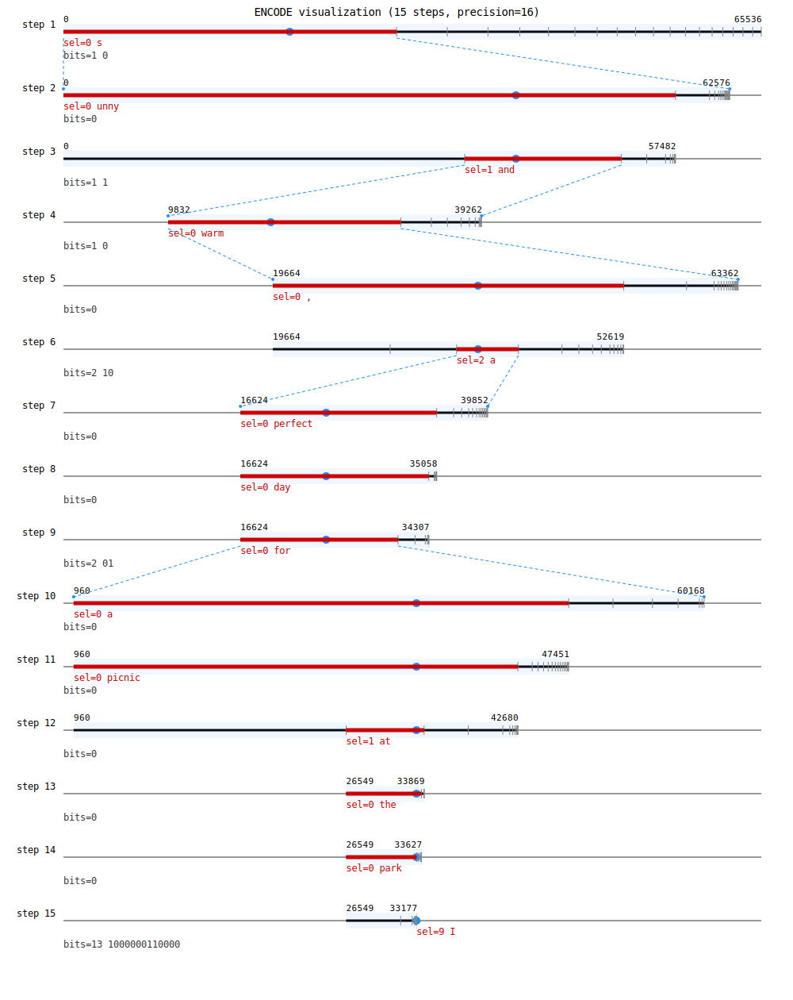

# Stego Arithmetic Coding

A Python library for steganographic encoding and decoding using arithmetic coding to hide secret messages within LLM-generated text.

## Features

- **Arithmetic Coding Steganography**: Hide messages by influencing token selection in language models
- **OpenAI Integration**: Uses OpenAI's API to get token probabilities
- **CLI Interface**: Command-line tools for encoding, decoding, helper conversions, and visualization
- **Artifacts & Visualization**: Optional artifacts (JSON logs) and SVG visualizations for each step
- **Flexible API**: Easy-to-use Python API for integration

## Installation

```bash
# Basic installation
pip install .

# With CLI support
pip install .[cli]

# With testing dependencies
pip install .[test]
```

## Quick Start

### Python API

```python
from stego_arith_coding import ArithmeticSteganography

# Initialize with your OpenAI API key
stego = ArithmeticSteganography(model="gpt-3.5-turbo-1106") # WARN: Other models are non-deterministic

# Encode a message
context = "The weather today is "
message = "SECRET"
message_bits = stego.text_to_bits(message)
encoded_text = stego.encode(context, message_bits)

print(f"Encoded: {encoded_text}")

# Decode the message
decoded_bits = stego.decode(context, encoded_text, message_length=len(message_bits))
decoded_message = stego.bits_to_text(decoded_bits)

print(f"Decoded: {decoded_message}")
```

### CLI Usage

Global options:
- `--api-key` Override OPENAI_API_KEY for this invocation
- `-v, --verbose` Enable verbose logging

```bash
# Set your OpenAI API key (or pass --api-key)
export OPENAI_API_KEY="your-api-key-here"

# Encode a message (optionally write artifacts to a directory)
stego-arith encode "The weather today is " "SECRET" -a artifacts/encode_run

# Decode a message (you can pass the text directly or via a file)
stego-arith decode "The weather today is " "sunny and warm"
stego-arith decode "The weather today is " --input artifacts/encode_run/encoding-result.txt -a artifacts/decode_run

# Convert text to binary (with ETX EOF marker)
stego-arith text-to-bits "Hello"

# Convert binary to text (stops at ETX EOF marker)
stego-arith bits-to-text "0100100001100101011011000110110001101111"

# Render an SVG visualization from a coding_data.json file
stego-arith visualize artifacts/encode_run/encoding-coding-data.json
```

Artifacts:
- When `-a/--artifacts DIR` is provided, the CLI writes step-by-step JSON and logs to `DIR/`:
  - `encoding-coding-data.json` or `decoding-coding-data.json`
  - `encoding-visualization.svg` or `decoding-visualization.svg` (auto-rendered if JSON is present)
  - `encoding-verbose.log` or `decoding-verbose.log`
  - `encoding-result.txt` or `decoding-result.txt`

## How It Works

The library uses arithmetic coding steganography to hide messages:

1. **Context Analysis**: Gets token probabilities from a language model for the current context
2. **Interval Division**: Divides the probability space into intervals based on token probabilities  
3. **Message Encoding**: Selects tokens based on the secret message bits to encode
4. **Synchronization**: Maintains perfect synchronization between encoding and decoding

The key insight is that by carefully selecting which tokens to generate based on their probabilities, we can encode arbitrary binary data while maintaining natural-looking text.

## Visualization 

Example of the encoding process is below for: `stego-arith encode "The weather today is " "S"`



## API Reference

### ArithmeticSteganography

Main class for steganographic operations.

#### Methods

- `encode(context, message_bits, precision=16, artifacts_dir=None)`: Encode message bits into text; optionally write artifacts to `artifacts_dir`
- `decode(context, encoded_text, precision=16, message_length=None, artifacts_dir=None)`: Decode message from text; optionally write artifacts to `artifacts_dir`. Decoding uses an ETX (0x03) EOF marker; `message_length` is optional.
- `text_to_bits(text)`: Convert text to binary representation with ETX EOF marker appended
- `bits_to_text(bits)`: Convert binary data back to text; stops at the first ETX EOF marker

## Requirements

- Python >= 3.11
- OpenAI API key
- Dependencies: `openai`, `tiktoken`

## Testing

```bash
# Run tests (requires OPENAI_API_KEY for integration tests)
python -m pytest tests/

# Run specific test file
python tests/test_core.py
```

## License

MIT License - see LICENSE file for details.
